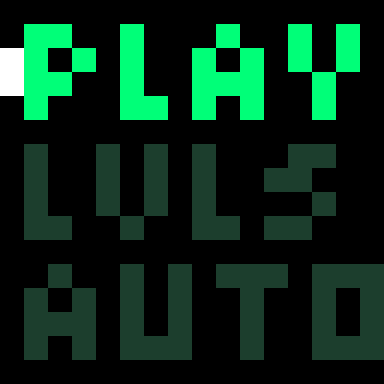
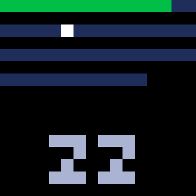
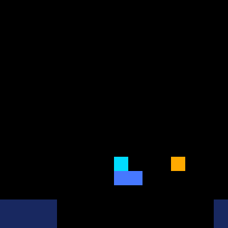
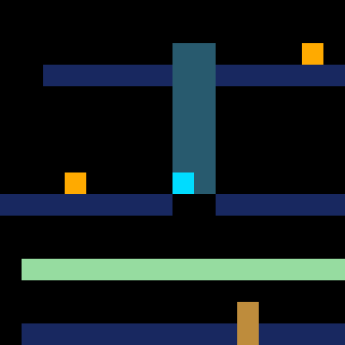
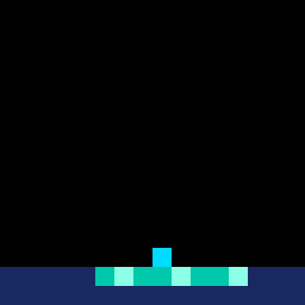
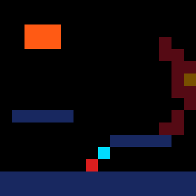

# The Platform Game

A side-scrolling platform game for the [Pimoroni Stellar
Unicorn](https://shop.pimoroni.com/products/space-unicorns) — a 16×16 RGB LED
panel — with three-channel chiptune from the panel's own speaker. Sixty
levels, four demon boss fights, and a menu drawn on the LEDs themselves.

Every screenshot below is a real frame, captured from auto-play through the
same code the **C** key uses in the app.

## The menu

| | |
| :---: | :---: |
|  |  |
| **PLAY** carries on from your first unfinished level. **LVLS** opens the picker. **AUTO** plays the game itself. | One pixel per level: green is finished, blue is not, the white blink is the cursor, and the number below names it. |

## Playing

Left and Right run, Up jumps — held for height, tapped for a hop. On a
ladder, Up and Down climb. Collect every coin to open the goal, then reach
it. There are no lives: anything that kills you starts the level over.

| | |
| :---: | :---: |
|  |  |
| Level 1: the cyan player mid-jump, an amber coin ahead. | Level 13: riding the bright-blue ferry across a pit too wide to jump. |
|  |  |
| Level 50 is two panels tall — updraught, one-way boards and a ladder, with the camera following up. | Level 22: the belt's highlight travels the way it pushes you. |

## The demons

Levels 15, 30, 45 and 60 end in an arena beneath an 8×8 demon, drawn dim
behind the level — you never touch it. It slams fists down where you stand
and throws fireballs on a pattern that quickens wave by wave; both kill.
There is no health bar. Survive everything it has and it withdraws, which is
what opens the goal.

*Level 60: the balrog looming at the right, a fist already falling.*

## Auto-play and capture

**AUTO** on the menu tours the levels using the solver's own winning routes,
so what it shows is a genuine playthrough under the real physics, not an
animation. It starts from whichever level you last had selected — so to film
level 40: **LVLS**, move the cursor to 40, **Esc**, **AUTO**. While it runs,
**Right**/**Left** skip to the next or previous level and **Esc** returns to
the menu.

**C** at any moment — menu, picker, mid-jump, mid-boss-fight — saves what
the panel is showing as a PNG in `~/Pictures` (or your home directory),
each LED a crisp 24×24 square. The status line names the file.

## What the colours mean

| Colour | What it is |
| --- | --- |
| cyan | you |
| amber | a coin |
| grey → flashing green | the goal, shut then open |
| dark blue | ground |
| bright blue | a platform sliding on a track — ride it |
| lime | a bounce pad, ~6 cells of lift |
| pale blue | ice: almost no grip |
| teal | a conveyor |
| rust | a crumbling tile — holds you once |
| magenta | a portal; its pair is elsewhere |
| brown | a ladder |
| pale green | a one-way platform: jump up through, land on top |
| flickering cyan | an updraught |
| violet | a blinking block, solid half the time |
| red | a spike |
| pink | an enemy pacing its ledge — go over, you cannot land on it |
| dim crimson/green/brass | a demon |
| orange / bright yellow | its fist and fireballs |

## For anyone editing levels

The ASCII in `levels.py` is generated — edit `tools/level_specs.py` and run
`python3 tools/build_levels.py && python3 tools/solve_routes.py` instead.
`tests/test_platform_levels.py` plays every level with the real physics and
refuses any that cannot be won; `tools/why_stuck.py <name>` shows which coin
or goal is out of reach and the cells a player can actually occupy. The
geometry rules that matter (ledges at most three cells apart, updraughts
reaching the lip they serve, no one-cell holes without a ladder) are
documented in the specs file, each one learned from a level that failed.
